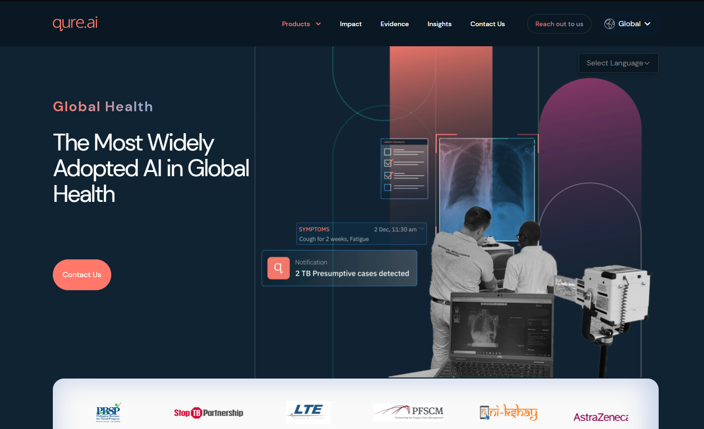
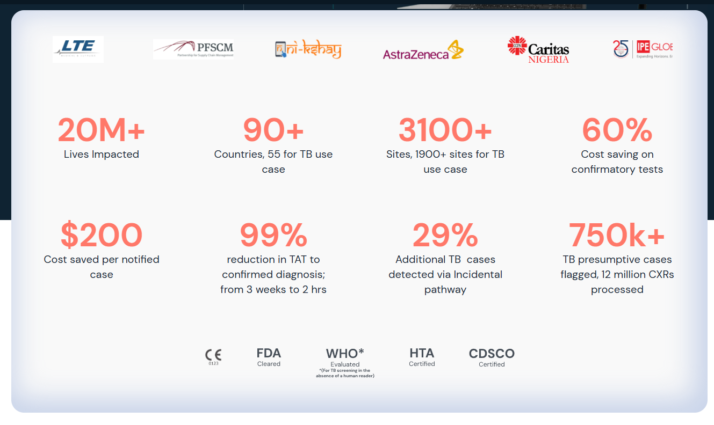
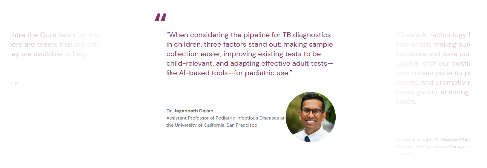
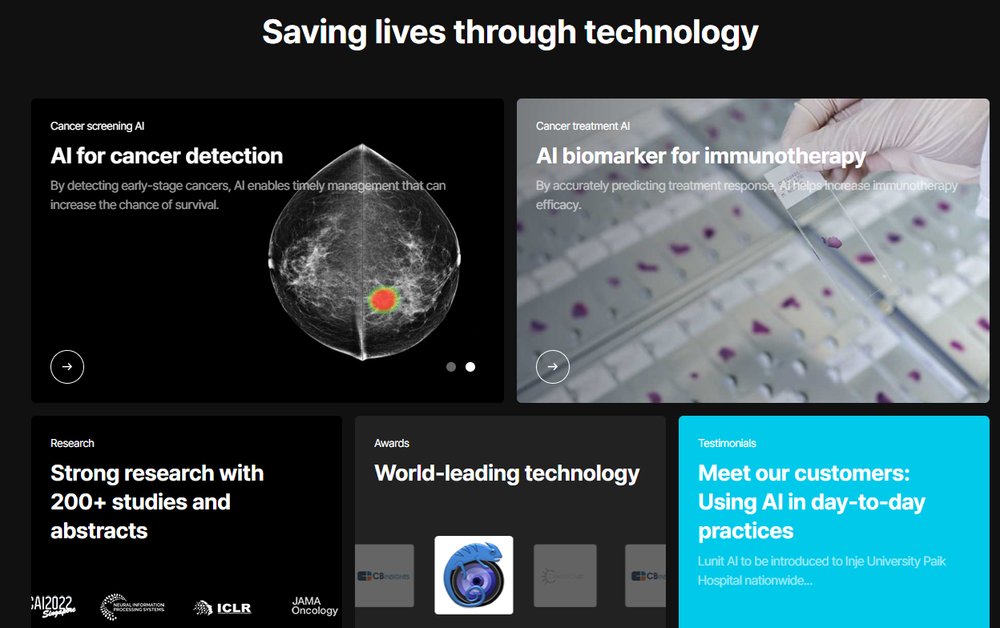
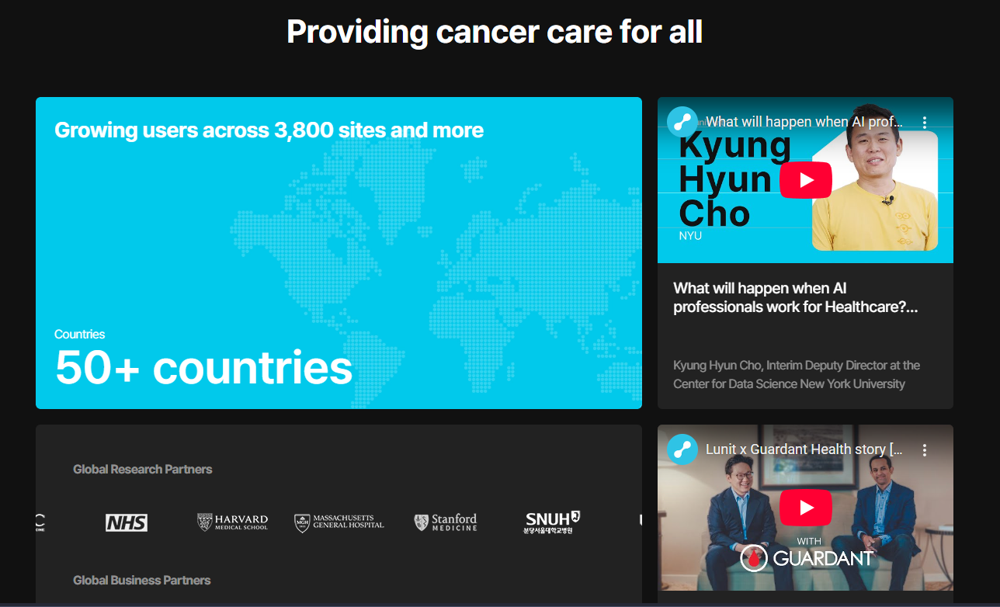
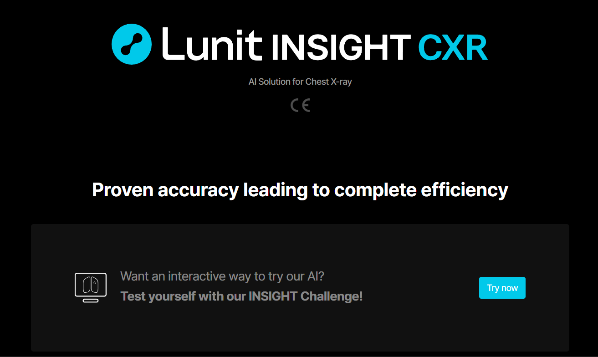
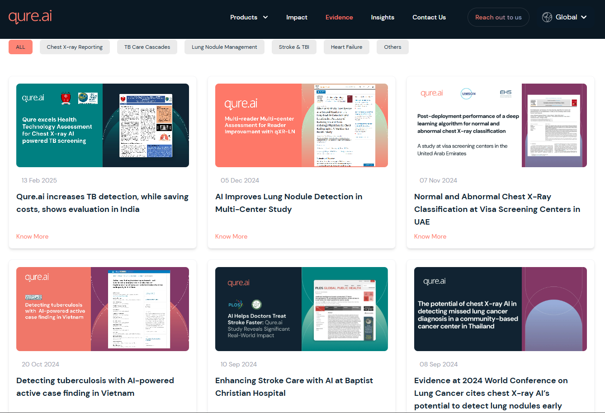
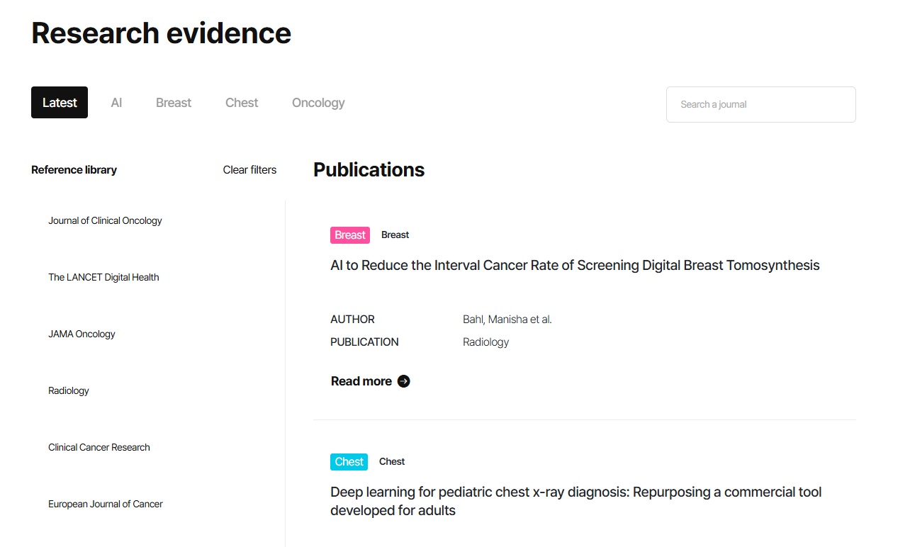

# Projeto de Interface Humano-Computador

Projeto apresentado ao Centro Universitário FEI, como parte dos requisitos necessários para aprovação na disciplina de **Interface Humano-Computador (CC8122)** do curso de Ciência da Computação, orientado pelo Prof. Dr. Plinio Thomaz Aquino Junior.

Este projeto se baseia no Trabalho de Conclusão de Curso (TCC) intitulado**“Desenvolvimento de Sistema de Apoio ao Diagnóstico de Pneumonia em Radiografias de Tórax utilizando Inteligência Artificial Explicável”**,sob orientação do Prof. Dr. Flavio Tonidandel e desenvolvido por:

- **Enzo Pacheco Porfirio** – 22.225.011-0
- **Gabriel Destro** – 24.122.059-9

---

## 📖 Resumo

A aplicação proposta é uma **plataforma web** que tem como objetivo **apoiar médicos no diagnóstico de pneumonia** a partir de radiografias de tórax.
O foco central é a **interface**, garantindo que os resultados apresentados pela inteligência artificial sejam **compreensíveis, confiáveis e integrados ao fluxo clínico do usuário**.

O sistema busca responder a questões como:

- Como apresentar resultados de forma **clara** e **rápida** no ambiente clínico?
- Como transmitir **confiança** ao profissional de saúde, evitando a sensação de “caixa-preta”?
- Como tornar a ferramenta **intuitiva e não invasiva**, respeitando a rotina clínica?

---

## 🎯 Introdução

O propósito do projeto é **projetar uma interface acessível** para sistemas de apoio ao diagnóstico por imagem.
Enquanto muitos softwares existentes oferecem apenas um valor numérico ou classificação, a nossa proposta busca apresentar informações de forma **visual, explicativa e alinhada às expectativas dos médicos**.

Principais benefícios oferecidos:

- **Suporte ao diagnóstico** sem substituir a decisão clínica.
- **Clareza e interpretabilidade** das decisões da IA.

---

## 🩺 Contexto de uso

- **Usuários**: médicos e profissionais de diagnóstico por imagem.
- **Tarefas**: carregar uma radiografia, visualizar o resultado e interpretar a imagem fornecida pelo sistema.
- **Equipamentos**: notebooks, desktops e tablets conectado à internet.
- **Ambiente**: consultórios, hospitais e clínica.
- **Fator social**: tempo limitado, decisões críticas e pressão por resultados.

---

## 🎯 Público-Alvo

O público principal são **médicos e profissionais da saúde** que lidam com diagnóstico por imagem.Características:

- **Demográficas**: profissionais da área médica, com faixa etária entre 25 e 75 anos.
- **Comportamentais**: necessitam de rapidez, clareza e confiabilidade nos resultados.
- **Psicográficas**: valorizam ferramentas que não interrompam ou atrapalhem o fluxo clínico.
- **Geográficas**: hospitais, clínicas e consultórios, desde áreas rurais até grandes centros urbanos.

---

## 🔍 Análise de Concorrência

Realizou-se uma análise de sistemas e ferramentas existentes voltados à visualização de imagens médicas e diagnóstico de pneumonia por radiografia de tórax.

### **Principais Concorrências:**

**Qure.ai** – Empresa indiana fundada em 2016, especializada no desenvolvimento de soluções baseadas em inteligência artificial para análise de imagens médicas, como radiografias de tórax e tomografias. Seus produtos auxiliam profissionais de saúde no diagnóstico rápido e preciso de doenças como pneumonia, tuberculose e hemorragias cerebrais, sendo utilizados em hospitais e clínicas em diversos países.

**Lunit** – Empresa sul-coreana fundada em 2013, especializada em inteligência artificial para diagnóstico médico por imagem. A Lunit desenvolve soluções de IA para análise de radiografias de tórax, mamografias e outros exames de imagem, oferecendo ferramentas que auxiliam radiologistas na detecção precoce de doenças como câncer de mama e doenças pulmonares. Suas tecnologias são utilizadas em hospitais e clínicas ao redor do mundo, com foco em melhorar a precisão diagnóstica e a eficiência do trabalho médico.

### **Características e funcionalidades dos concorrentes:**

**Qure.ai:**

- Análise de radiografias de tórax e tomografias
- Diagnóstico de pneumonia, tuberculose e hemorragias cerebrais
- Resultados rápidos e precisos
- Interface para profissionais de saúde
- Utilização em hospitais e clínicas globais

**Lunit:**

- Análise de radiografias de tórax e mamografias
- Detecção precoce de câncer de mama e doenças pulmonares
- Ferramentas para radiologistas
- Foco em precisão diagnóstica e eficiência médica
- Tecnologias utilizadas em hospitais e clínicas internacionais

### **Experiência do usuário (UX):**

**Qure.ai:**

- Interface limpa e organizada, com foco na visualização da imagem.
- Elementos de navegação simples e acessíveis.
- Destaque para resultados e laudos de forma clara e objetiva.
- Uso de cores sóbrias, transmitindo profissionalismo.
- Demonstração de marcas e empresas que se utilizam do seu serviço, mostrando também os dados e desempenho da aplicação.
- Informações relevantes apresentadas sem poluir a tela.

**Lunit:**

- Interface interativa, limpa e organizada, porém com o foco mais para noticias e avanços de IA no mercado.
- Navegação também é simples e acessível, conta com uma barra de navegação.
- Uso de cores sombrias, também para transmitir profissionalismo e seriedade.
- Também demonstra marcas e estatisticas de uso sobre os serviços prestados, disponibilizando dados e muitas informações para clientes.
- Highlight: O site permite com que você teste a ferramenta para ver como ela realiza o diagnóstico.

### **Preços e modelos de negócio:**

Ambas as plataformas, Lunit e Qure.ai, funcionam com contratos diretos e especificos com empresas, eles oferecem o próprio software deles ou integração com softwares pré-existentes. Não conseguimos encontrar em algum lugar um valor fixo ou especifico.

### **Satisfação do cliente e opiniões:**

Em ambos os sites, é possível observar uma região dedicada apenas ao feedback de médicos e clientes das plataformas. Também é possível acessar estudos relacionados a IA na Medicina que se utilizaram das plataformas para serem realizados.

### **Padrões e tendências:**

Com base na análise das interfaces e funcionalidades das plataformas Qure.ai e Lunit, foram identificados os seguintes padrões e tendências:

**Padrões de Design:**

- **Interface minimalista**: Ambas as plataformas utilizam designs limpos e organizados, evitando poluição visual
- **Paleta de cores sóbria**: Uso predominante de tons escuros (cinza, preto, azul) para transmitir profissionalismo e seriedade
- **Navegação intuitiva**: Elementos de navegação simples e acessíveis, facilitando o uso por profissionais médicos
- **Foco na visualização**: Destaque para as imagens médicas e resultados, com informações secundárias bem organizadas

**Padrões de Funcionalidade:**

- **Resultados rápidos**: Ambas priorizam a velocidade de análise e apresentação dos resultados
- **Transparência de dados**: Demonstração de estatísticas de uso, performance e casos de sucesso
- **Credibilidade institucional**: Exibição de parcerias com hospitais e clínicas reconhecidas
- **Feedback de usuários**: Seções dedicadas aos depoimentos de médicos e profissionais de saúde

**Tendências de Mercado:**

- **Modelo B2B**: Foco em contratos diretos com instituições de saúde, não em vendas individuais
- **Integração com sistemas existentes**: Oferecem tanto software próprio quanto integração com plataformas já utilizadas
- **Validação científica**: Presença de estudos e pesquisas que validam a eficácia das ferramentas
- **Globalização**: Atuação em mercados internacionais, não apenas localmente

**Tendências Tecnológicas:**

- **IA Explicável**: Movimento em direção à transparência das decisões da inteligência artificial
- **Automação sem substituição**: Foco em apoiar, não substituir, a decisão médica
- **Acessibilidade multiplataforma**: Funcionalidade em diferentes dispositivos (desktop, tablet, mobile)
- **Demonstração interativa**: Possibilidade de testar as ferramentas antes da implementação

**Tendências de UX/UI:**

- **Design responsivo**: Adaptação para diferentes tamanhos de tela
- **Hierarquia visual clara**: Informações organizadas por importância e relevância
- **Feedback visual**: Indicadores claros de status e progresso das análises
- **Acessibilidade**: Consideração para diferentes níveis de expertise tecnológica dos usuários

**Relatórios e resumo dos resultados:**

### **Resumo dos Resultados - Qure.ai**

**Pontos Fortes:**

- Interface limpa e organizada com foco na visualização de imagens médicas
- Navegação simples e acessível para profissionais de saúde
- Apresentação clara e objetiva de resultados e laudos
- Paleta de cores sóbria (tons escuros) que transmite profissionalismo
- Demonstração de credibilidade através de parcerias com hospitais reconhecidos
- Apresentação de dados de desempenho e estatísticas de uso
- Informações relevantes bem organizadas sem poluição visual

**Funcionalidades Principais:**

- Análise de radiografias de tórax e tomografias
- Diagnóstico de pneumonia, tuberculose e hemorragias cerebrais
- Resultados rápidos e precisos
- Interface específica para profissionais de saúde
- Utilização global em hospitais e clínicas

**Modelo de Negócio:**

- Contratos diretos e específicos com empresas
- Oferece software próprio ou integração com sistemas existentes
- Foco em modelo B2B (Business-to-Business)

### **Resumo dos Resultados - Lunit**

**Pontos Fortes:**

- Interface interativa e moderna com foco em notícias e avanços de IA
- Navegação simples com barra de navegação bem estruturada
- Uso de cores sombrias para transmitir seriedade e profissionalismo
- Demonstração de credibilidade através de estatísticas e casos de uso
- **Diferencial**: Possibilidade de testar a ferramenta antes da implementação
- Seção dedicada a estudos e pesquisas científicas
- Apresentação de feedback de médicos e profissionais de saúde

**Funcionalidades Principais:**

- Análise de radiografias de tórax e mamografias
- Detecção precoce de câncer de mama e doenças pulmonares
- Ferramentas especializadas para radiologistas
- Foco em precisão diagnóstica e eficiência médica
- Tecnologias utilizadas internacionalmente

**Modelo de Negócio:**

- Contratos diretos com instituições de saúde
- Oferece software próprio ou integração com plataformas existentes
- Modelo B2B sem valores fixos publicamente disponíveis

### **Principais Diferenças Identificadas:**

**Qure.ai:**

- Foco mais direto na visualização e análise de imagens
- Interface mais tradicional e clínica
- Especialização em radiografias de tórax e tomografias
- Apresentação mais conservadora dos resultados

**Lunit:**

- Interface mais moderna e interativa
- Destaque para demonstração da tecnologia (teste da ferramenta)
- Maior variedade de exames (incluindo mamografias)
- Foco em inovação e avanços tecnológicos
- Maior ênfase em estudos científicos e validação

**Aspectos Comuns:**

- Ambas priorizam credibilidade e profissionalismo
- Foco em modelo B2B com contratos institucionais
- Interface responsiva e acessível
- Demonstração de parcerias e casos de sucesso
- Seções dedicadas ao feedback de usuários

### **Pontos Positivos Identificados:**

**Design e Interface:**

- Interfaces limpas e minimalistas que evitam poluição visual
- Paleta de cores sóbria (tons escuros) que transmite profissionalismo
- Navegação intuitiva e acessível para profissionais médicos
- Foco na visualização das imagens médicas

**Funcionalidades:**

- Resultados rápidos e precisos
- Demonstração de credibilidade através de parcerias e estatísticas
- Seções dedicadas ao feedback de usuários
- Validação científica com estudos e pesquisas

**Modelo de Negócio:**

- Foco em contratos B2B com instituições de saúde
- Flexibilidade para integração com sistemas existentes
- Atuação em mercados internacionais

### **Recomendações para o Projeto:**

**Interface e UX:**

- Adotar design minimalista com foco na visualização de imagens
- Utilizar paleta de cores sóbria (tons escuros) para transmitir profissionalismo
- Implementar navegação simples e intuitiva
- Priorizar a rapidez na apresentação de resultados

**Funcionalidades:**

- Incluir seção de demonstração/teste da ferramenta
- Criar área dedicada ao feedback de usuários
- Apresentar estatísticas de performance e casos de sucesso
- Incorporar validação científica com estudos relacionados

**Diferenciação:**

- Desenvolver interface mais moderna e interativa que a Qure.ai
- Focar na IA explicável como diferencial principal
- Oferecer maior transparência nas decisões da IA
- Implementar recursos de demonstração interativa

---

## 👥 Personas _(a serem desenvolvidas)_

---

## 🧠 Mapa de Empatia _(a ser desenvolvido)_

---
